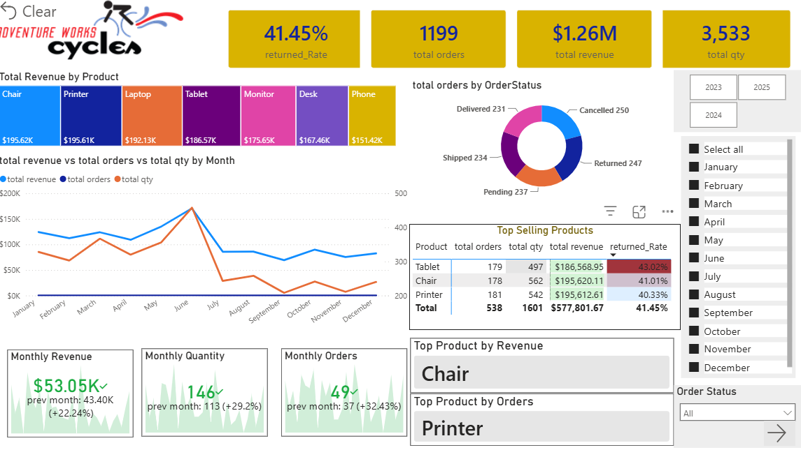
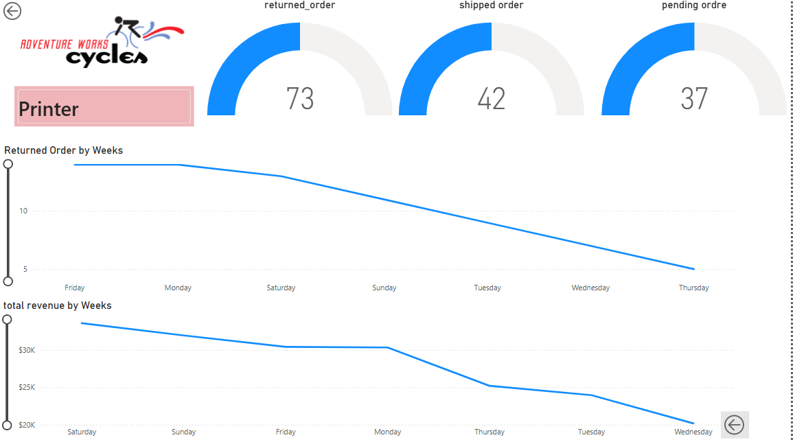

# 📊 E-Commerce Analytics Dashboard (Power BI)

An interactive, end-to-end **Power BI E-Commerce Analytics Dashboard** designed to analyze key business performance metrics, customer purchasing behavior, sales trends, and product-level insights.

---

## 📌 Features & Key Insights

* **Overview Dashboard:** Executive-level summary showing total sales, profit, order volume, return rates, and high-level KPIs.
* **Product Detail Dashboard:** In-depth breakdown of category performance, top-selling products, profitability per item, and sales distribution.
* **Customer & Sales Trends:** Time-series analysis of sales performance over time to identify seasonal trends and peak demand periods.
* **Interactive Filtering:** Slicers for date range, product categories, regions, and fulfillment status for dynamic data exploration.

---

## 🖼️ Dashboard Preview

### 1. Main Executive Dashboard


### 2. Product Detail View


---

## 📂 Repository Structure

├── Dashboard.png                 # Preview screenshot of the Main Overview Dashboard
├── Product Detail Dashboard.png  # Preview screenshot of the Product Detail view
├── E-Commerce Data.csv           # Raw/cleaned sales dataset
├── E-Commerce Visualization.pbix # Interactive Power BI Dashboard file
└── README.md                     # Project documentation


---

## 🛠️ Tools & Technologies Used

* **Power BI Desktop:** Data modeling, DAX measures, visual design, and dashboard layouts.
* **Power Query:** Data extraction, transformation, cleaning, and custom column creation.
* **Data Source:** CSV dataset containing order history, customer demographic data, product categories, and financial metrics.

---

## 🚀 How to Run & View the Project

1. **Prerequisite:** Download and install [Power BI Desktop](https://powerbi.microsoft.com/desktop/).
2. **Clone / Download Repository:**
   ```bash
   git clone [https://github.com/AdnanArif22/E-Commerce-Dashboard-PowerBI.git](https://github.com/AdnanArif22/E-Commerce-Dashboard-PowerBI.git)
Open the Dashboard: Double-click E-Commerce Visualization.pbix to launch the interactive report directly in Power BI Desktop.

🤝 Contributing & Feedback
Feel free to fork this repository, explore the DAX measures, or suggest improvements by submitting a pull request or opening an issue!

